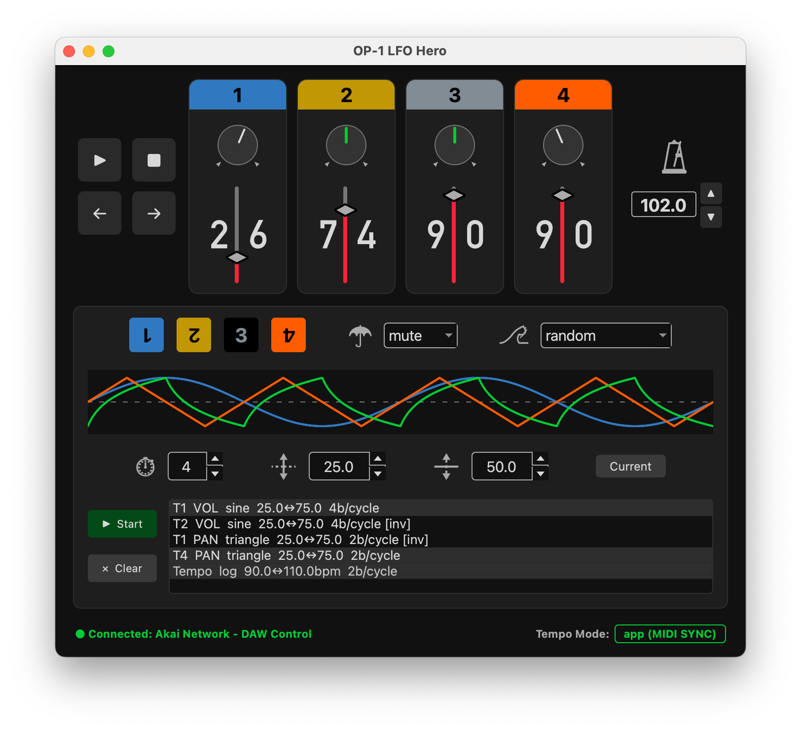

# op1-lfo-hero

Custom MIDI LFOs (low frequency oscillators) for the Teenage Engineering OP-1 Field synthesizer to control per-track volume, pan, mute, and tempo with automation curves. Handles these OP-1 tempo modes:
1. `BEAT MATCH` aka `op1` (ext clock) -> op1 sends clock to app: used to sync the LFOs
2. `MIDI SYNC` aka `app` (int clock) -> app sends clock to op1: generates tempo, transport, and tape navigation commands



---

## Running the App

**Requirements:**
- Teenage Engineering OP-1 Field
- USB-C cable
- Python 3.11 or newer
- macOS (tested) or Windows/Linux (untested but should work)

With the OP-1 connected and the virtual environment activated:

```bash
source venv/bin/activate
python -m src.app
```

The app auto-detects the OP-1 by port name (looks for "op-1" case-insensitively). If detection fails, a dialog will appear — check that the USB-C cable is connected and the OP-1 is powered on.

The status bar at the bottom of the window shows the connected port name once MIDI is established.

---

## Using the App

### Transport Controls (left column)

| Button | Action |
|--------|--------|
| **Play** | Sends MIDI Start (first press) or Continue (subsequent presses). OP-1 tape begins playing from the current position. |
| **Stop** | Sends MIDI Stop. OP-1 tape halts. |
| **←** | Sends CC 82 (tape previous bar) and updates the song position pointer. |
| **→** | Sends CC 83 (tape next bar) and updates the song position pointer. |

**Note:** The OP-1 must be in `Midi Sync` mode for Play/Stop/←/→ to affect the tape. In other modes these buttons have no effect on tape transport.

---

### BPM

- Displays the current tempo with one decimal place (e.g. `120.0`)
- The app generates a continuous **24 PPQN MIDI clock** signal — the OP-1 locks to this tempo in MIDI Sync mode
- **Arrow keys** — increment/decrement by 1.0 BPM
- **Type a value** and press **Enter** to set an exact tempo
- Range: 20.0 - 300.0 BPM

Changes take effect immediately; the OP-1's BPM display updates in real time.

---

### Track Strips

Each of the four tracks corresponds to an OP-1 Field mixer channel (tracks 1-4 = MIDI channels 1-4).

#### Mute button (top)
- Colored header button showing the track number
- Click to toggle mute on/off; the button dims when muted
- Sends CC 9 (127 = muted, 0 = unmuted)

#### Pan knob
- Dark circular dial below the fader
- Center position (12 o'clock) = center pan (MIDI 64) — line is **orange**
- Off-center — line is **white**, pointing toward the pan direction
- Click and drag up/down to adjust; sends CC 10
- Labels: **L** (left) and **R** (right)

#### Volume fader
- Vertical slider, range 0-99 (maps to MIDI 0-127)
- Default: **90** (MIDI 115)
- The filled portion below the handle turns red to show the current level
- The numeric value is shown below the fader
- Drag or click to adjust; sends CC 7

---

### LFO Panel

The LFO panel (below the track strips) applies beat-synchronized automation curves to any track parameter.

#### Waveform selector
Choose the LFO shape: **Sine**, **Triangle**, **Sawtooth**, **Square**, or **Hold** (sample & hold).

#### Waveform preview
A live preview of the selected waveform shape is drawn in the panel. The number of visible cycles scales with the Rate setting.

#### Controls (per row)

| Control | Description |
|---------|-------------|
| **Rate** | How many LFO cycles per bar (beat-synced) |
| **Depth** | How much the parameter value swings from center |
| **Center** | The midpoint value the LFO oscillates around |
| **Range** | Readout showing the min-max value the LFO will reach, derived from Center ± Depth |

#### Inverted LFOs

When two or more tracks are selected, the **Invert 2nd+** checkbox becomes available. With it checked, the first selected track gets the normal waveform and every additional track gets the same waveform flipped upside-down — its output is `center - (wave x depth)` instead of `center + (wave x depth)`.

This means when the primary track's value rises, the secondary tracks' values fall by the same amount, and vice versa. Some uses:

- **Stereo pan spread** — assign the same LFO to tracks 1 and 2 with Pan selected and Invert enabled. Track 1 sweeps left while track 2 sweeps right, keeping an even stereo image.
- **Pumping sidechain feel** — automate Volume on two tracks so one ducks while the other swells.
- **Call and response** — run an inverted LFO on a second melody track so phrases naturally dovetail rather than stack.

The active LFO list marks inverted clips with `[inv]` so you can tell them apart at a glance.


#### Buttons

| Button | Action |
|--------|--------|
| **Start** | Begin LFO automation on the selected tracks and parameter |
| **Stop Selected** | Stop automation on the currently selected clip |
| **Stop All** | Stop all running automation clips immediately |

---

## Installation

### 1. Clone the repository

```bash
git clone https://github.com/andrewralon/op1-midi.git
cd op1-midi
```

### 2. Create a virtual environment

```bash
python3 -m venv venv
```

### 3. Activate the virtual environment

**macOS / Linux:**
```bash
source venv/bin/activate
```

**Windows:**
```cmd
venv\Scripts\activate
```

You should see `(venv)` in your terminal prompt.

### 4. Install dependencies

```bash
pip install -r requirements.txt
```

This installs:
- `mido` — MIDI I/O library
- `python-rtmidi` — low-latency MIDI backend for mido
- `PyQt6` — desktop UI framework
- `numpy` — used by the automation engine

---

## Troubleshooting

**App shows "MIDI Connection Failed"**
- Make sure the OP-1 is powered on and connected via USB-C before launching
- Try a different USB-C cable (some are charge-only)
- On macOS, check **System Settings → Privacy & Security** if any MIDI access prompt was dismissed

**Controls send but OP-1 doesn't respond (volume, pan, mute, transport all ignored)**
- macOS CoreMIDI can get into a bad state where the port appears available but no data flows
- Fix: `sudo pkill -9 coremidi` in the terminal, then unplug and replug the OP-1 — no restart needed

**OP-1 tape doesn't respond to Play/Stop**
- Confirm the OP-1 is in MIDI Sync mode (COM → MIDI → SYNC: MIDI)
- The OP-1 BPM display should show `--` when waiting for clock — if it shows an internal BPM, Sync mode is not active

**BPM on the OP-1 doesn't match the app**
- The OP-1 needs a few seconds of continuous clock signal to lock in; the display may lag slightly after a BPM change

**Left/right buttons stop playback**
- This is a known OP-1 behavior: receiving a Song Position Pointer message while playing causes the OP-1 to stop and wait for a Continue or Start. Press Play after navigating to resume.

**Pan knob jumps unexpectedly**
- QDial uses click-to-set by default. Click and drag vertically for fine control.

---

## MIDI Reference

| CC | Function | Range | Notes |
|----|----------|-------|-------|
| 7  | Volume   | 0-127 | Per channel (track 1-4 = channel 1-4) |
| 9  | Mute     | 0-127 | ≥ 64 = muted |
| 10 | Pan      | 0-127 | 64 = center |
| 79 | Octave   | 0-127 | < 64 = down, ≥ 64 = up (keyboard/synth mode only) |
| 82 | Tape prev bar | 127 | Tape navigation |
| 83 | Tape next bar | 127 | Tape navigation |

**Transport messages**

| Message | MIDI Status | Description |
|---------|-------------|-------------|
| Clock   | 0xF8 | Sent at 24 PPQN continuously |
| Start   | 0xFA | Begin playback from position 0 |
| Continue| 0xFB | Resume from current song position |
| Stop    | 0xFC | Halt playback |
| Song Position Pointer | 0xF2 | Sets resume position in MIDI beats |

OP-1 Field Midi Reference: https://teenage.engineering/guides/op-1#midi-reference
