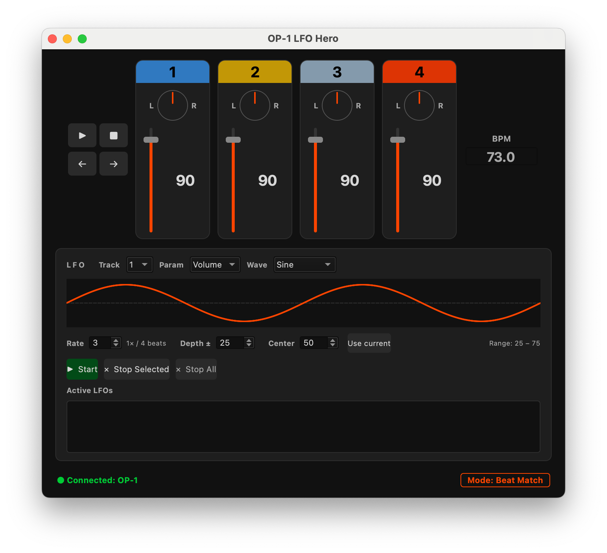
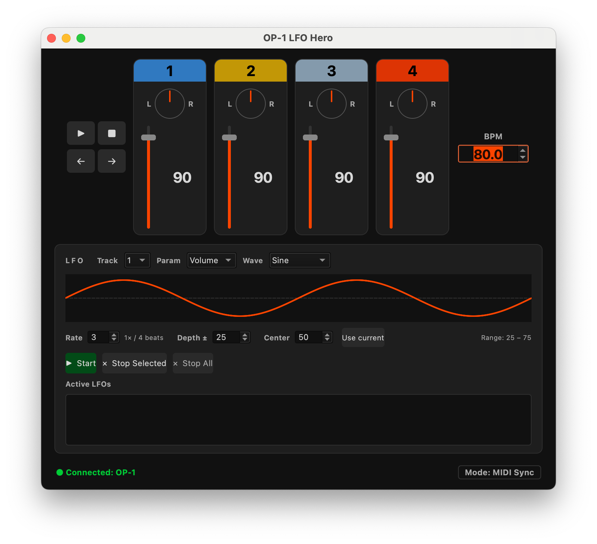

# op1-lfo




Custom MIDI LFOs (low frequency oscillators) for the Teenage Engineering OP-1 Field synthesizer to control per-track volume, pan, and mute with automation curves. 

This app handles two different MIDI clock tempo modes:
1. Beat Match -> OP1 sends clock to app: used to sync the LFOs
2. Midi Sync -> app sends clock to OP1: generates tempo, transport, and tape navigation commands

---

## Requirements

**Hardware**
- Teenage Engineering OP-1 Field
- USB-C cable (data-capable, not charge-only)
- Mac or PC with a USB-C or USB-A port

**Software**
- Python 3.11 or newer
- macOS (tested) or Windows/Linux (untested but should work)

---

## Installation

### 1. Clone the repository

```bash
git clone https://github.com/andrewralon/op1-midi.git
cd op1-midi
```

### 2. Create a virtual environment

```bash
python3 -m venv venv
```

### 3. Activate the virtual environment

**macOS / Linux:**
```bash
source venv/bin/activate
```

**Windows:**
```cmd
venv\Scripts\activate
```

You should see `(venv)` in your terminal prompt.

### 4. Install dependencies

```bash
pip install -r requirements.txt
```

This installs:
- `mido` — MIDI I/O library
- `python-rtmidi` — low-latency MIDI backend for mido
- `PyQt6` — desktop UI framework
- `numpy` — used by the automation engine

---

## OP-1 Field Configuration

Before launching the app, configure the OP-1 Field to receive MIDI clock from an external source.

### Enable MIDI Sync mode

1. On the OP-1 Field, press and hold **COM** (the shift key)
2. Navigate to **MIDI** settings
3. Set **SYNC** to **MIDI** (not INT or USB)

In this mode the OP-1 tape transport is slaved to incoming MIDI clock. The OP-1's BPM display will show `--` until it receives a clock signal — this is normal.

### Connect via USB-C

Plug the OP-1 Field into your computer with a USB-C data cable. The device should appear as a MIDI port automatically on macOS. No driver installation is required.

---

## Running the App

With the OP-1 connected and the virtual environment activated:

```bash
python -m src.app
```

The app auto-detects the OP-1 by port name (looks for "op-1" case-insensitively). If detection fails, a dialog will appear — check that the USB-C cable is connected and the OP-1 is powered on.

The status bar at the bottom of the window shows the connected port name once MIDI is established.

---

## Using the App

### Window Layout

```
[ Play  Stop ]  [ Track 1 ] [ Track 2 ] [ Track 3 ] [ Track 4 ]  [ BPM    ]
[ ←     →    ]                                                     [       ]
                          ── status bar ──
```

- **Left column** — transport and tape navigation buttons
- **Center** — four track strips (one per OP-1 mixer track)
- **Right column** — BPM control

---

### Transport Controls (left column)

| Button | Action |
|--------|--------|
| **Play** | Sends MIDI Start (first press) or Continue (subsequent presses). OP-1 tape begins playing from the current position. |
| **Stop** | Sends MIDI Stop. OP-1 tape halts. |
| **←** | Sends CC 82 (tape previous bar) and updates the song position pointer. |
| **→** | Sends CC 83 (tape next bar) and updates the song position pointer. |

**Note:** The OP-1 must be in MIDI Sync mode for Play/Stop/← /→ to affect the tape. In other modes these buttons have no effect on tape transport.

---

### BPM Control (right column)

- Displays the current tempo with one decimal place (e.g. `120.0`)
- The app generates a continuous **24 PPQN MIDI clock** signal — the OP-1 locks to this tempo in MIDI Sync mode
- **Arrow keys** — increment/decrement by 1.0 BPM
- **Type a value** and press **Enter** to set an exact tempo
- Range: 20.0 – 300.0 BPM

Changes take effect immediately; the OP-1's BPM display updates in real time.

---

### Track Strips

Each of the four tracks corresponds to an OP-1 Field mixer channel (tracks 1–4 = MIDI channels 1–4).

#### Mute button (top)
- Colored header button showing the track number
- Click to toggle mute on/off; the button dims when muted
- Sends CC 9 (127 = muted, 0 = unmuted)

#### Volume fader
- Vertical slider, range 0–99 (maps to MIDI 0–127)
- Default: **90** (MIDI 115)
- The filled portion below the handle turns red to show the current level
- The numeric value is shown below the fader
- Drag or click to adjust; sends CC 7

#### Pan knob
- Dark circular dial below the fader
- Center position (12 o'clock) = center pan (MIDI 64) — line is **orange**
- Off-center — line is **white**, pointing toward the pan direction
- Click and drag up/down to adjust; sends CC 10
- Labels: **L** (left) and **R** (right)

---

### LFO Panel

The LFO panel (below the track strips) applies beat-synchronized automation curves to any track parameter.

#### Waveform selector
Choose the LFO shape: **Sine**, **Triangle**, **Sawtooth**, **Square**, or **Hold** (sample & hold).

#### Waveform preview
A live preview of the selected waveform shape is drawn in the panel. The number of visible cycles scales with the Rate setting.

#### Controls (per row)

| Control | Description |
|---------|-------------|
| **Rate** | How many LFO cycles per bar (beat-synced) |
| **Depth** | How much the parameter value swings from center |
| **Center** | The midpoint value the LFO oscillates around |
| **Range** | Readout showing the min–max value the LFO will reach, derived from Center ± Depth |

#### Buttons

| Button | Action |
|--------|--------|
| **Start** | Begin LFO automation on the selected track and parameter |
| **Stop Selected** | Stop automation on the currently selected clip |
| **Stop All** | Stop all running automation clips immediately |

---

## Troubleshooting

**App shows "MIDI Connection Failed"**
- Make sure the OP-1 is powered on and connected via USB-C before launching
- Try a different USB-C cable (some are charge-only)
- On macOS, check **System Settings → Privacy & Security** if any MIDI access prompt was dismissed

**OP-1 tape doesn't respond to Play/Stop**
- Confirm the OP-1 is in MIDI Sync mode (COM → MIDI → SYNC: MIDI)
- The OP-1 BPM display should show `--` when waiting for clock — if it shows an internal BPM, Sync mode is not active

**BPM on the OP-1 doesn't match the app**
- The OP-1 needs a few seconds of continuous clock signal to lock in; the display may lag slightly after a BPM change

**Left/right buttons stop playback**
- This is a known OP-1 behavior: receiving a Song Position Pointer message while playing causes the OP-1 to stop and wait for a Continue or Start. Press Play after navigating to resume.

**Pan knob jumps unexpectedly**
- QDial uses click-to-set by default. Click and drag vertically for fine control.

---

## MIDI Reference

| CC | Function | Range | Notes |
|----|----------|-------|-------|
| 7  | Volume   | 0–127 | Per channel (track 1–4 = channel 1–4) |
| 9  | Mute     | 0–127 | ≥ 64 = muted |
| 10 | Pan      | 0–127 | 64 = center |
| 79 | Octave   | 0–127 | < 64 = down, ≥ 64 = up (keyboard/synth mode only) |
| 82 | Tape prev bar | 127 | Tape navigation |
| 83 | Tape next bar | 127 | Tape navigation |

**Transport messages**

| Message | MIDI Status | Description |
|---------|-------------|-------------|
| Clock   | 0xF8 | Sent at 24 PPQN continuously |
| Start   | 0xFA | Begin playback from position 0 |
| Continue| 0xFB | Resume from current song position |
| Stop    | 0xFC | Halt playback |
| Song Position Pointer | 0xF2 | Sets resume position in MIDI beats |
